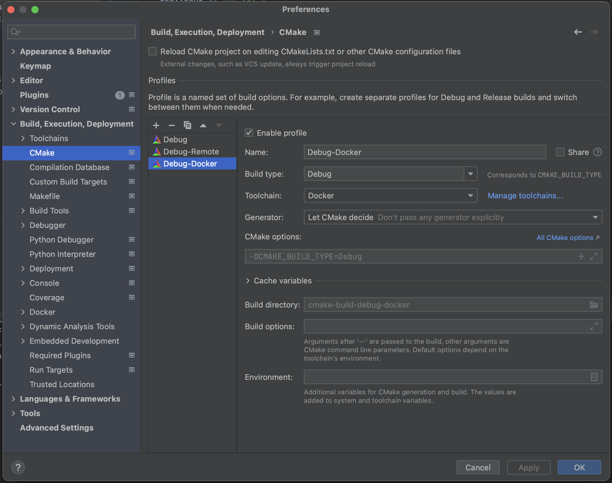

C++ Docker
====

One simple template to setup c++ development environment in MacOS M1 with docker.

## CLion Config

### Local

1. toolchain
   
   

2. cmake
   
   

### Remote Host

1. toolchain
  
   
   

2. cmake
   
   

3. deployment
   
   
   
   

## Docker

1. toolchain

   

2. cmake

   

3. deployment

   
   

## Reference

1. [Remote C++ Development with Docker and CLion (with X11)](https://austinmorlan.com/posts/docker_clion_development/)
   - This blog shared some code for building the base docker image, while its targeting of X11 make the whole thing much more complicated than what I want here.
2. [Using Docker with CLion](https://blog.jetbrains.com/clion/2020/01/using-docker-with-clion/)
   - It shares the latest configuration in Clion for remote development with local sources.
3. [Containerize a C++ application](https://docs.docker.com/guides/language/cpp/containerize/)
   - [code](https://github.com/Pradumnasaraf/c-plus-plus-docker)
4. [The Remote GDB Server configuration](https://www.jetbrains.com/help/clion/remote-gdb-server.html)
5. [Docker toolchain](https://www.jetbrains.com/help/clion/clion-toolchains-in-docker.html)
6. [Remote with local sources](https://www.jetbrains.com/help/clion/remote-projects-support.html)
   - resync header search paths
   - 

## Useful Commands

1. `ssh-keygen -f "$HOME/.ssh/known_hosts" -R "[localhost]:2222"`
2. `ssh <server> -o StrictHostKeyChecking=no`